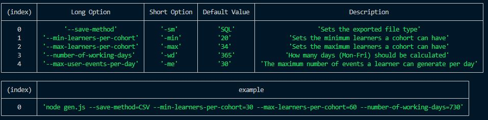

# Fake Data Generator

Used for generating dummy data for this dashboard application. It vaguely "simulates" over a period of time and generates this data dynamically. There are some options you can set to change the output, and how much data is generated. Copy the outputed sql query into the `/dashboard/db/sql` folder to ensure it's loaded into Docker when you run `docker-compose up -d`.

## How do I use it?
It's a little bt of a process, but I'll explain it step by step.

1. Ensure you're in the ./extras directory in your terminal
2. Run `node gen.js` (this will generate data using default values)
3. Once finished, 5 files will appear under the `./data` folder.
4. Each file is a single INSERT query that will insert all the data for that table (this happens very quickly, almost instant)
5. Believe me when I say it would take 30 minutes to run 400k insert queries haha..
6. It doesn't now, because it's 1 insert query with many values (runs almost instantly)
7. Enjoy your new data.

### Options?
For more help run `node gen.js -h` or `node gen.js --help`

Or look at this screenshot of that..
